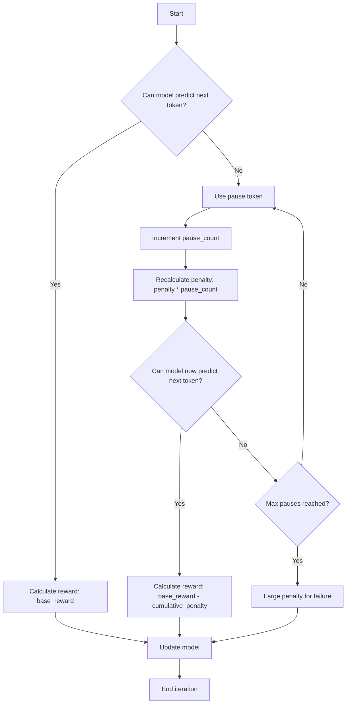

# learned_pause

## Pretraining plan based off google pause token paper from ICLR 2024

## RL Plan

```mermaid
graph TD
    A[Start] --> B{Can model predict next token?}
    B -->|Yes| C[Calculate reward: base_reward]
    B -->|No| D[Use pause token]
    D --> E[Increment pause_count]
    E --> F[Recalculate penalty: penalty * pause_count]
    F --> G{Can model now predict next token?}
    G -->|Yes| H[Calculate reward: base_reward - cumulative_penalty]
    G -->|No| I{Max pauses reached?}
    I -->|Yes| J[Large penalty for failure]
    I -->|No| D
    C --> K[Update model]
    H --> K
    J --> K
    K --> L[End iteration]
```